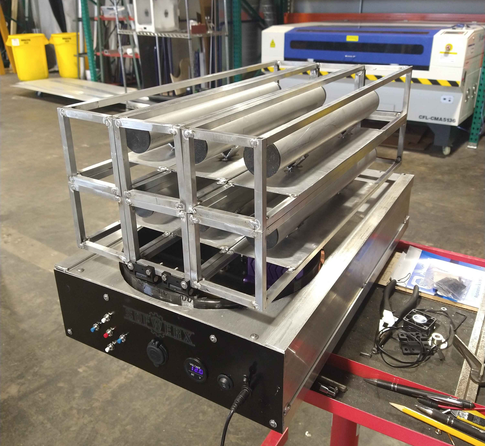

Project Watchdog

This project is a smaller representation of the SOF Rapid Dragon.

The project uses two Nema 17 stepper motors, one for vertical rotation and one for horizontal rotation
There is a Raspberry Pi 3 as the main driver, an arduino MEGA for controlling the neopixel LEDS,
and an ESP8266 (WiFi microcontroller) which is for hosting a simple website with buttons that can
be clicked to move the missile array in all four directions.

-Hardware Connections-

Use this word doc to see how to wire everything together. There's two diagrams for the RPi, one for when
viewing it with the USBs below, and one for viewing it rotated 180 degrees from this. This is so no matter
which way you're viewing it from, you can refer to the diagram without having to mentally rotate it 180
degrees. The other chips have one diagram or even no diagram because their connections are very simple.

-Schematic-

The schematic shows a detailed electrical layout of the whole project. Note that the stepper motor HAT
we use for the project does not have a symbol on EasyEDA, so I had to make it myself. Also, the stepper
motor HAT does not visibly connect to the RPi in the schematic, but understand that the HAT should fit
on top of the RPi, and all references to the RPi GPIO is actually referring to the HAT's extension of
the RPi GPIO.

Power comes into the whole project via the power adapter on the stepper motor hat. this provides power to
the RPi, and 5v and 3v3 supply for the arduino, neopixel, and ESP8266 all come from the RPi's 3v3 and 5v
pins. GND is common everywhere so utilize all the GND pins on the RPi to keep everything grounded properly.
You don't have to explicitly ground the stepper motor hat.

IMPORTANT - the schematic includes pull up resistors for the physical buttons and pull down resistors
for the website inputs. These resistors exist inside the RPi and are set to pull up and down respectively
WITHIN steppermove2.py. You can see this near the top of the code. In other words, you do not need external
resistors. The resistors are included in the schematic for thoroughness.

-Code-

There are 3 essential codes for this project:

RPi Code - steppermove2.py

Controls the stepper motors. Takes physical buttons and web server buttons as inputs to move the payload.

Arduino Code - OrangeLedcode.ino

Turns on the neopixel led strip and sets it to the color requested by Director Leslie Babich. THIS COLOR
IS NOT TO BE CHANGED.

ESP8266 Code - 4buttons_via_wifi.ino

establishes WiFi server on the specified WiFi. You can simply change the two strings at the beginning of the
code that correspond to the wifi address and password, and change it. You just have to change those two strings to change what
WiFi server you're connecting to.

There's also a WiFi test code that is very similar to the 4buttons_via_wifi.ino but doesn't really correlate to
our application, and is just for testing the chip / server.

-WiFi Microcontroller Info-

The NodeMCU ESP8266 is a WiFi Microcontroller that lets you flash code onto it, then it runs that code automatically
when turned on (like an arduino). This code is specifically for web hosting capabilities. The pins on the ESP8266
correspond to values in the code. So when a button is pressed on the website, the voltage on that pin is changed. 
Use the arduino IDE to send code to the ESP8266. However, you'll need to change the specified board before uploading.
The Arduino IDE is not natively meant to upload to ESP8266s, so you can open the arduino IDE and go to File>Preferences
and see "Additional Boards Manager URLs:" Then paste this into that field:

http://arduino.esp8266.com/stable/package_esp8266com_index.json

this lets you go to the board dropdown in Tools and pick between a large number of different models of the ESP8266. 
The one you want is called:

Node MCU 1.0 (ESP-12E Module)

Now you can upload arduino code to the board.
